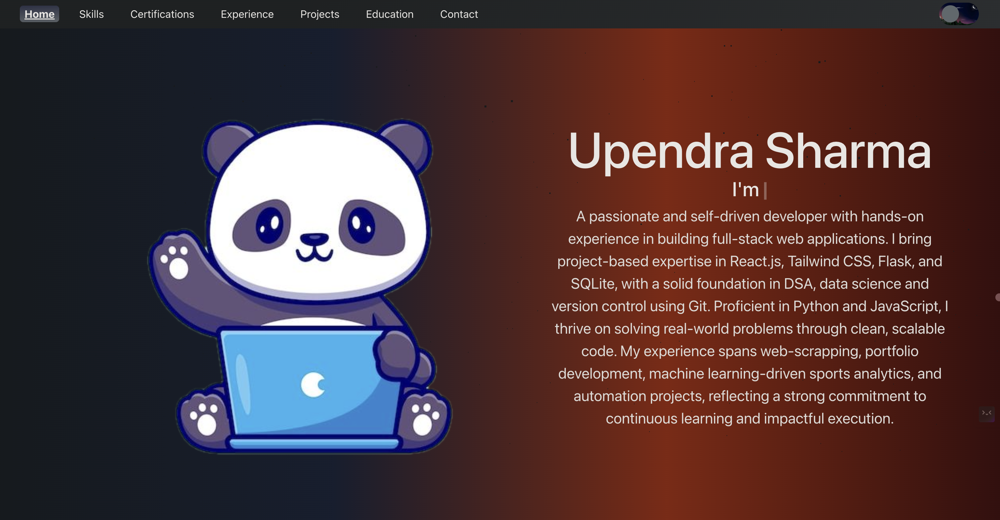

# Portfolio Website

Welcome to my portfolio website repository! This project showcases my work, skills, and experience in a professional and engaging way.

## Table of Contents
- Introduction
- Installation
- Features
- Screenshots
- Technologies Used
- Contributing

## Introduction
This portfolio website is built using React, showcasing the best practices in web development with a focus on performance and accessibility.

## Installation
1. Clone this repository: `git clone https://github.com/upendra657/portfolio-website.git`
2. Navigate to the project directory: `cd portfolio-website`
3. Install dependencies: `npm install`
4. Start the development server: `npm start`

## Features

- **Responsive Design**: Looks great on both desktop and mobile devices.
- **Customizable Themes**: Easily change the color scheme to match your personal brand.
- **Dynamic Content**: Showcase your projects and blogs with real-time data.
- **SEO Optimized**: Helps you get found by potential employers or clients.
- **Interactive UI**: Engage visitors with interactive elements and animations.

## Screenshots

🔗 [Demo Link](public/images/ss.png)

## Technologies Used
- JavaScript
- React
- CSS
- EmailJS for contact form functionality

## Contributing
Contributions are what make the open-source community such an amazing place to learn, inspire, and create. Any contributions you make are greatly appreciated.
1. Fork the repository.
2. Create a new branch: `git checkout -b feature/your-feature`
3. Make your changes and commit them: `git commit -m "Add feature"`
4. Push to the branch: `git push origin feature/your-feature`
5. Create a pull request.
